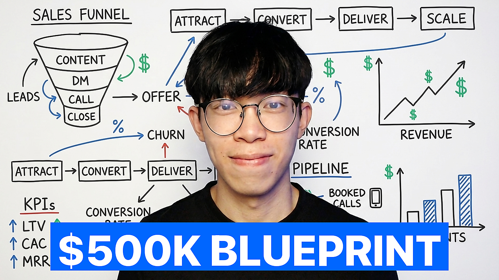
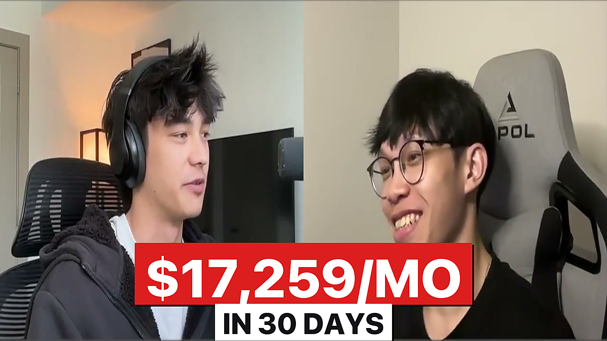

# YouTube Thumbnail Workflow

> A production-grade thumbnail pipeline hardened over 100+ real iterations on a YouTube channel. Turns strategy videos, case studies, and personal brand thumbnails into finished 1920x1080 outputs with one command.



## What this is

A set of Python scripts + a documented design system that turn the hardest parts of YouTube thumbnails into defaults instead of guesses.

**What it handles for you:**

- Strict face matching via Gemini 3 Pro Image Preview (Nano Banana Pro). Mouth closed unless source shows otherwise, head large (35-40% vertical), pose matches your source photo, face never hallucinated.
- Real labels on any whiteboard or graphic content. You pass a word list, the script tells Gemini to use only those words. No gibberish placeholders.
- Single-banner headlines rendered by PIL with SF Pro Heavy, 78% frame width, 1920x1080 upscale. Never Gemini-rendered text (Gemini hallucinates apostrophes, duplicates letters, mangles spacing).
- Fazio-style case study format. Pulls a still from the actual interview video, crops letterbox, renders red money banner + white time-frame subheader.
- Configurable creator profile. Your face description, brand picture folder, and default accent colour live in one `profile.json`.

**Why it exists:**

Most thumbnail tools either over-promise AI magic (every thumbnail looks the same) or under-deliver (leave every judgment call to the user). This project sits in the middle. It bakes in every hard-learned rule from hundreds of real rejections into the default behaviour, so you stop re-deriving them per project. The strategy chapters in `docs/` explain why every rule exists.

Credit: architecture forked from [Tyler Germain's youtube-thumbnail skill](https://fridaylabs.com) at Friday Labs. This version hardens Tyler's foundation with validated design-system rules.

## Quick start

### 1. Clone and install

```bash
git clone https://github.com/justlowys/youtube-thumbnail-workflow.git
cd youtube-thumbnail-workflow
pip install Pillow google-genai numpy
# optional: for case study video frame extraction
brew install yt-dlp ffmpeg
```

### 2. Set your Gemini API key

Put it in `~/.claude/.env` or any `.env` in the project root:

```
GEMINI_API_KEY=your-key-here
# optional, for auto-transcript fetching in the orchestrator:
SUPADATA_API_KEY=your-key-here
```

### 3. Configure your profile

```bash
cp profile.example.json profile.json
```

Edit `profile.json` to describe your face and point at your headshot folder:

```json
{
  "creator_name": "Your Name",
  "channel_handle": "@yourhandle",
  "face_description": "young asian man, round youthful face, dark bowl-cut hair, round black wire-frame glasses, clean-shaven, early twenties",
  "brand_pictures_dir": "~/Downloads/Brand Pictures",
  "default_outfit": "black t-shirt",
  "default_accent_color": "blue",
  "case_study_accent_color": "red"
}
```

Write the `face_description` as if you were describing yourself to a stranger at a party. Hair, glasses, facial hair, approximate age, skin tone. Specific > generic.

### 4. Add your headshots

Drop 5-15 photos of yourself into `brand_pictures_dir`. Name each file with a short expression label:

```
01 neutral-slight-smile.jpg
02 calm-neutral.jpg
03 shock-wide-eyes.jpg
06 open-hands-explain.jpg
09 pointing-finger-right.jpg
12 both-hands-raised.jpg
14 smile-neutral.jpg
```

Mix of expressions: neutral, slight smile, serious, shocked, explaining, pointing, both hands raised. These become the face references the Gemini script picks from.

### 5. Generate your first thumbnail

```bash
python3 scripts/thumbnail.py \
  --brand-pic "12 both-hands-raised" \
  --style dense-whiteboard \
  --headline '$500K BLUEPRINT' \
  --labels "SALES FUNNEL,CONTENT,DM,CALL,CLOSE,ATTRACT,CONVERT,DELIVER,SCALE,KPIs,REVENUE,PIPELINE,LTV,CAC,MRR" \
  --output out/blueprint.png
```

Done. You have a 1920x1080 thumbnail.

## Scripts

| Script | Purpose |
|---|---|
| `generate_bg.py` | Generate a Gemini background with face + style constraints applied |
| `overlay_text.py` | PIL headline overlay with the winning formula defaults |
| `case_study.py` | Fazio-style case study builder (video frame + money banner) |
| `thumbnail.py` | End-to-end orchestrator (bg gen + overlay in one call) |

Each script has `--help` with full flags.

## Styles

| Style | Use for |
|---|---|
| `dense-whiteboard` | Strategy / framework / system videos |
| `burning-paper` | "Mistakes" / "what not to do" / negative list videos |
| `cinematic-quote` | Personal / authority / lesson videos with a quoted headline |
| `split-cold-warm` | Comparison / before-after / this-vs-that videos |
| `clean-portrait` | PFPs, simple hook videos, clean brand shots |

## Case studies (Fazio format)

For client-win videos ("How X made $Y in Z time"):

```bash
python3 scripts/case_study.py \
  --video-id kDxl9sGOwqU \
  --amount '$17,259/MO' \
  --timeframe "IN 30 DAYS" \
  --frame-time 60 \
  --output out/case-study.png
```

Downloads the video, extracts a still with both faces from the interview, crops letterbox, renders the red/white money banner. Uses real interview stills so both faces are 100% authentic (Gemini never generates client faces). See [docs/06-case-studies.md](./docs/06-case-studies.md) for why this format converts.



## The design system (read this)

The `docs/` folder contains the strategy chapters. If you only read one, read `docs/01-design-system.md` — it's the hard rules distilled. The rest explain WHY each rule exists:

- [01 Design System](./docs/01-design-system.md) — the hard rules (fonts, banners, face, labels, upscale)
- [02 Viewer Psychology](./docs/02-viewer-psychology.md) — the 3-step click loop + the 7 visual stun gun elements
- [03 Desire Loops](./docs/03-desire-loops.md) — how to frame what the thumbnail promises
- [04 Composition](./docs/04-composition.md) — symmetrical, rule-of-thirds, A→B split
- [05 Iteration Process](./docs/05-iteration-process.md) — how to iterate fast + the feedback translation table
- [06 Case Studies](./docs/06-case-studies.md) — the Fazio format, why it converts, when to use it

## Hard rules (the short version)

- Single solid banner headline, not two split colours (case study is the exception).
- SF Pro Heavy weight (between Bold and Black).
- Real correctly-spelled words on any whiteboard or graphic content. Never let Gemini invent labels.
- Face large: 35-40% of vertical height, y=15-55%.
- Mouth closed unless the source photo shows otherwise.
- Pose matches the source brand picture, don't force a new pose.
- PIL overlay for all text, never Gemini-rendered headlines.
- Upscale to 1920x1080 with LANCZOS + UnsharpMask.
- For case studies: use interview stills, never Gemini-generated faces.

## Iteration translation table

When your collaborator says X, change Y:

| User says | Fix |
|---|---|
| face too small / too low | `--face-size 0.42` |
| mouth weird | verify `--mouth closed` (default) or check source photo |
| doesn't look like me | try a different brand pic or refine `face_description` in profile |
| wrong words on the graphic | pass a real `--labels` word list |
| headline too big / small | adjust `--text-width-ratio` by 0.05 |
| two highlights | use default `--banner-style single` |
| different colour | generate 3-4 colour variants in parallel |
| graphic too simple | iterate the `--labels` list or try a different style |
| doesn't pop | check the banner colour contrasts the background |
| give me variations | spawn 3-4 parallel runs, don't describe options in text |

## Background

The architecture pattern (markdown instructions + Python scripts + self-contained folder) is Tyler Germain's invention for the [Claude Code skills system](https://claude.com/plugins/superpowers). This project packages the same pattern as a standalone CLI repo, hardened with additional rules learned from 100+ real iterations.

## License

MIT.
